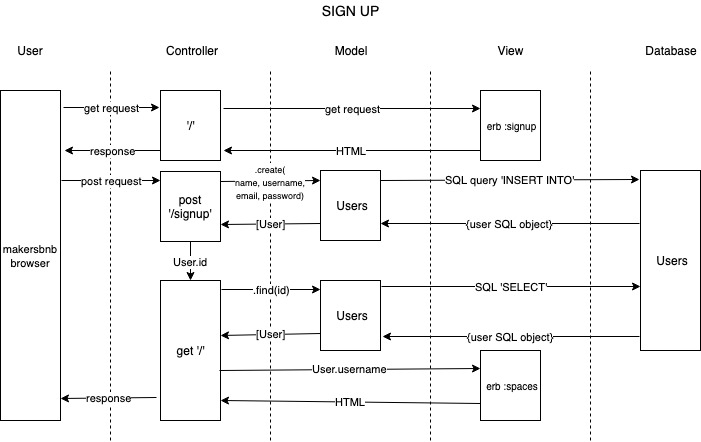

# MAKERS BNB
## TEAM ALPHA

---

**Headline specifications**

1. Any signed-up user can list a new space.
1. Users can list multiple spaces.
1. Users should be able to name their space, provide a short description of the space, and a price per night.  
1. Users should be able to offer a range of dates where their space is available.
1. Any signed-up user can request to hire any space for one night, and this should be approved by the user that owns that space.
1. Nights for which a space has already been booked should not be available for users to book that space.
1. Until a user has confirmed a booking request, that space can still be booked for that night.

**As user stories:**

1. As a user(both),
I would like to sign up to Makers BnB with name, username, email, and password.

1. As a user(both),
So only I can use my account,
I would like to login to my Makers BnB account.



1. As a user(leaser),
so I can list a new space,
I would like to add a name, description, price, availability dates and photo.


1. As a user(renter),
so I can find a space to stay,
I would like view only spaces that are available for specific dates

1. As a user(renter),
so I can rent a space,
I would like a request a booking on a listed space.

1. As a user(leaser),
so someone can rent my space,
I would like to confirm or deny a request.

1. As a user(both),
so many people can request to stay
my space will stay available until I've confirmed a booking

1. As a user(both),
my space will become unavailable when I have confirmed a booking.


---

**Datamapper**

This caused us a bunch of headaches as we bumbled our way through including it, but became useful once we were familiar with it.

DataMapper is an ORM: an Object-Relational Mapping. 
Basically, it's a library that lets you work with your database from object-oriented code. Instead of writing any query code ourselves we include an adapter for mysql, postgresql or any other language we create our databases with.

In the gem file:
```
gem 'data_mapper'
gem 'dm-postgres-adapter'
```
To include in spec helper for tests and app for dev:
```
require 'data_mapper'
require 'dm-postgres-adapter'
```
