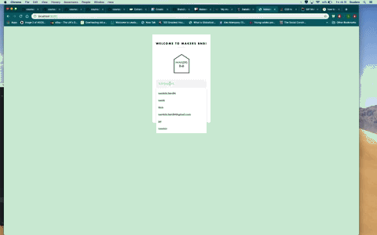
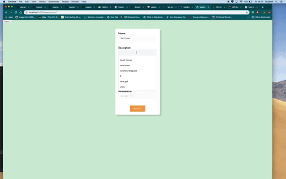
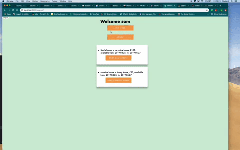

# MAKERS BNB

*Read this for our development process ==>* ***APPROACH.md***

### INTRODUCTION

The aim of this project was to create a small Air BnB clone that allows users to advertise and book spaces.

The project is provided by Makers Academy. The challenge takes place over the sixth week of the course and is the first project in which students must work with one another as part of a development team.

### GETTING STARTED

GET THE PROJECT:
* Fork/clone this project
* In the terminal, run `bundle` to install all the dev dependencies

RUNNING THE PROJECT:
* In the terminal, type `rackup` to start the server (by default served on localhost:9292)
* Load up http://localhost:9292/ in your browser of choice

### HOW TO USE THE APP

Here are some gifs on how to use our app.

1.  Either login or signup. (Make sure you enter your details correctly or you'll see an error message.)

2. Add your own space by clicking on the 'ADD SPACE' button and complete the form.

3. You can book a space by clicking on the 'BOOK *space name*' button. Your 'spaces' view won't show any spaces if no other users have added any, so make sure someone has signed up and added a few!

4. Finally, you can review the booking requests that have been made against your properties by clicking the 'REVIEW' button. Here you can confirm or deny the booking requests.

### RUNNING TESTS

Tests can be run from the root directory with `rspec`

### TECH/FRAMEWORK USED

This project follows the RSpec testing framework using capybara. Find out more about Capybara [here](http://teamcapybara.github.io/capybara/).

`"RSpec is a Behaviour-Driven Development tool for Ruby programmers. BDD is an approach to software development that combines Test-Driven Development, Domain Driven Design, and Acceptance Test-Driven Planning. RSpec helps you do the TDD part of that equation, focusing on the documentation and design aspects of TDD."` [Link](https://relishapp.com/rspec)

`Sinatra` the ruby web framework will be used to develop this app. It will follow the MVC development pattern. Ruby will be used as the programming language and HTML in Sinatra views for the user interface.

`PostgreSQL` has been used for the database. PostgreSQL is a free open-source relational database management system, designed to handle a range of workloads, from single machines to data warehouses or Web services with many concurrent users. [PostgresSQL](https://www.postgresql.org/)

`DataMapper` has been used as our ORM to create and manage the tables within the database. [DataMapper](https://datamapper.org/)

While developing the app the Ruby web server interface, Rack, was used. More info can be found at [Rack](https://rack.github.io/)
